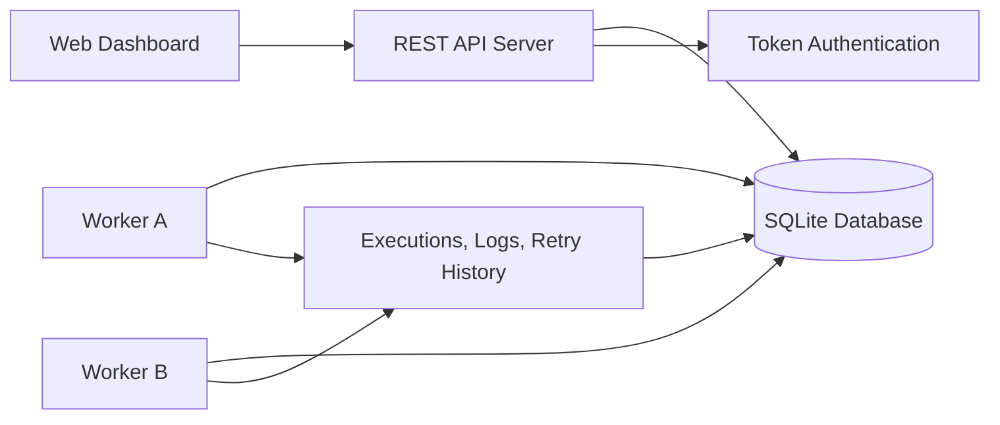
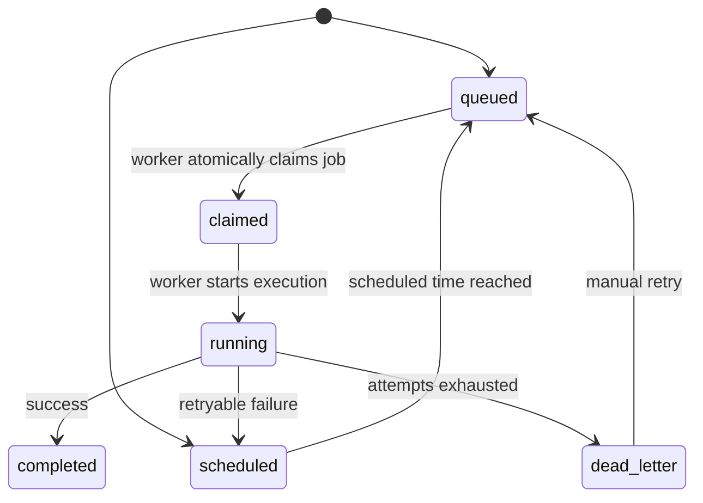
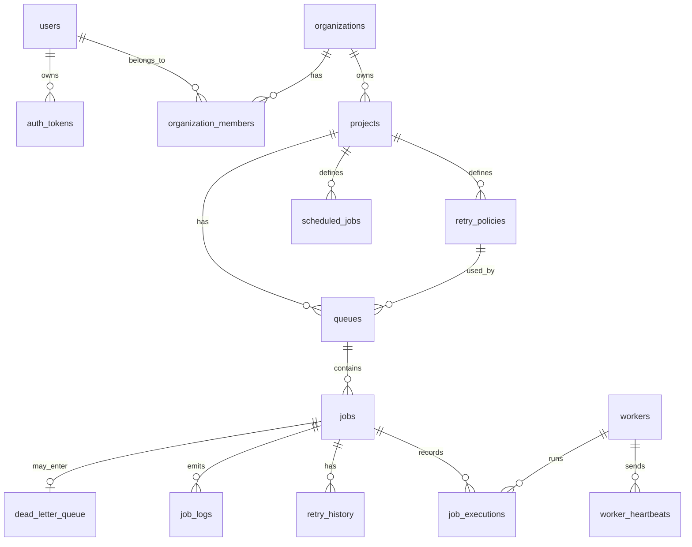

# Distributed Job Scheduler - Final Project Documentation

## 1. Objective

This project implements a production-inspired distributed job scheduling platform that reliably executes asynchronous background jobs across workers. It includes authentication, project and queue management, REST APIs, atomic job claiming, retry handling, dead letter queue support, worker heartbeats, logs, metrics, and a responsive web dashboard.

## 2. Technology Stack

- Backend: Python standard library HTTP server
- Database: SQLite with relational schema, foreign keys, indexes, and WAL mode
- Frontend: HTML, CSS, JavaScript
- Worker: Python polling worker with concurrent execution
- Authentication: Bearer token authentication
- Tests: Python `unittest`

No external packages are required.

## 3. Project Folder

```text
C:\Users\ASUA\Documents\Codex\2026-07-04\intern-assignment-distributed-job-scheduler-objective\outputs\distributed-job-scheduler
```

## 4. Source Code Structure

```text
app/
  __init__.py
  auth.py
  db.py
  main.py
  scheduler.py
  worker.py

static/
  index.html
  styles.css
  app.js

docs/
  architecture.md
  er-diagram.md
  api.md
  design-decisions.md

tests/
  test_api.py
  test_scheduler.py

README.md
RUN_STEP_BY_STEP.md
FINAL_PROJECT_DOCUMENTATION.md
```

## 5. Setup Instructions

Open PowerShell and run:

```powershell
cd C:\Users\ASUA\Documents\Codex\2026-07-04\intern-assignment-distributed-job-scheduler-objective\outputs\distributed-job-scheduler
python -m app.main --init-db --seed
python -m app.main --serve
```

Open:

```text
http://127.0.0.1:8000
```

Demo login:

```text
Email: demo@example.com
Password: demo-password
```

Start a worker in a second PowerShell window:

```powershell
cd C:\Users\ASUA\Documents\Codex\2026-07-04\intern-assignment-distributed-job-scheduler-objective\outputs\distributed-job-scheduler
python -m app.worker --worker-name worker-a
```

Run tests:

```powershell
python -m unittest discover -s tests
```

Expected result:

```text
Ran 6 tests
OK
```

## 6. Architecture



### Components

- Web dashboard: queue health, workers, job explorer, logs, retry actions, system metrics.
- REST API: authentication, projects, queues, retry policies, jobs, logs, health.
- Database: normalized relational schema storing all project, queue, job, worker, and execution data.
- Worker service: polls queues, atomically claims jobs, runs jobs concurrently, heartbeats, and shuts down gracefully.

## 7. Job Lifecycle



Statuses implemented:

- `queued`
- `scheduled`
- `claimed`
- `running`
- `completed`
- `failed`
- `dead_letter`
- `cancelled`

## 8. Database Design

### Tables

- `users`
- `auth_tokens`
- `organizations`
- `organization_members`
- `projects`
- `retry_policies`
- `queues`
- `jobs`
- `job_executions`
- `retry_history`
- `workers`
- `worker_heartbeats`
- `job_logs`
- `scheduled_jobs`
- `dead_letter_queue`

## 9. ER Diagram



## 10. Primary Keys, Foreign Keys, And Cascading

All major tables use integer primary keys for simple indexing and joins.

Important relationships:

- `projects.organization_id` references `organizations.id`
- `queues.project_id` references `projects.id`
- `queues.retry_policy_id` references `retry_policies.id`
- `jobs.project_id` references `projects.id`
- `jobs.queue_id` references `queues.id`
- `job_executions.job_id` references `jobs.id`
- `job_logs.job_id` references `jobs.id`
- `retry_history.job_id` references `jobs.id`
- `dead_letter_queue.job_id` references `jobs.id`
- `workers` are referenced by job executions and worker heartbeats

Cascading behavior:

- Deleting organizations cascades to projects and memberships.
- Deleting projects cascades to queues, jobs, retry policies, and schedules.
- Deleting jobs cascades to executions, logs, retry history, and DLQ records.
- Deleting retry policies sets queue retry policy to null.
- Deleting workers sets execution worker reference to null.

## 11. Indexes And Performance

Important indexes:

```sql
idx_jobs_claimable(queue_id, status, scheduled_at, priority, created_at)
idx_jobs_project_status(project_id, status, created_at)
idx_jobs_worker(locked_by_worker_id, status)
idx_executions_job(job_id, attempt_number)
idx_logs_job_time(job_id, created_at)
idx_workers_status_heartbeat(status, last_heartbeat_at)
idx_scheduled_jobs_next(is_active, next_run_at)
```

Performance considerations:

- Worker polling uses `idx_jobs_claimable`.
- Dashboard filtering uses project and status indexes.
- Logs are indexed by job and timestamp.
- Heartbeat checks are indexed by worker status and time.
- SQLite WAL mode improves concurrent read/write behavior.

## 12. Backend REST API

### Auth

```http
POST /api/auth/register
POST /api/auth/login
GET  /api/me
```

### Projects

```http
GET  /api/projects
POST /api/projects
GET  /api/projects/{project_id}
```

### Retry Policies

```http
GET  /api/projects/{project_id}/retry-policies
POST /api/projects/{project_id}/retry-policies
```

Supported retry strategies:

- `fixed`
- `linear`
- `exponential`

### Queues

```http
GET   /api/projects/{project_id}/queues
POST  /api/projects/{project_id}/queues
PATCH /api/projects/{project_id}/queues/{queue_id}
POST  /api/projects/{project_id}/queues/{queue_id}/pause
POST  /api/projects/{project_id}/queues/{queue_id}/resume
```

Queue configuration:

- Priority
- Concurrency limit
- Retry policy
- Pause/resume
- Statistics

### Jobs

```http
GET  /api/projects/{project_id}/jobs
POST /api/projects/{project_id}/jobs
POST /api/projects/{project_id}/jobs/batch
GET  /api/projects/{project_id}/jobs/{job_id}
GET  /api/projects/{project_id}/jobs/{job_id}/logs
POST /api/projects/{project_id}/jobs/{job_id}/retry
```

Job types supported through API:

- Immediate jobs
- Delayed jobs
- Scheduled jobs
- Recurring cron-like jobs
- Batch jobs

### Health And Workers

```http
GET /api/projects/{project_id}/health
GET /api/workers
```

## 13. API Examples

### Create Immediate Job

```json
{
  "queue_id": 1,
  "type": "send_email",
  "priority": 100,
  "payload": {
    "to": "customer@example.com",
    "duration_seconds": 0.5
  }
}
```

### Create Scheduled Job

```json
{
  "queue_id": 1,
  "type": "scheduled_email",
  "priority": 100,
  "scheduled_at": "2026-07-04T12:30:00+05:30",
  "payload": {
    "to": "scheduled@example.com"
  }
}
```

### Create Failing Job For Dead Letter Queue

```json
{
  "queue_id": 1,
  "type": "failing_job",
  "payload": {
    "fail": true,
    "error": "testing dead letter"
  }
}
```

### Create Batch Jobs

```json
{
  "queue_id": 1,
  "jobs": [
    {
      "type": "email",
      "payload": { "to": "a@example.com" }
    },
    {
      "type": "email",
      "payload": { "to": "b@example.com" }
    }
  ]
}
```

## 14. Worker Service

The worker service:

- Registers itself in the `workers` table.
- Sends heartbeat entries.
- Polls queues for available jobs.
- Claims jobs atomically.
- Executes jobs concurrently.
- Updates execution status and metrics.
- Retries failed jobs based on policy.
- Moves permanently failed jobs to dead letter queue.
- Supports graceful shutdown with `Ctrl + C`.

Run worker:

```powershell
python -m app.worker --worker-name worker-a
```

Run another worker:

```powershell
python -m app.worker --worker-name worker-b
```

## 15. Atomic Claiming And Concurrency

The scheduler claims jobs using a write transaction:

```text
BEGIN IMMEDIATE
find eligible queued job
check queue pause status
check queue concurrency limit
mark job as claimed
assign worker
create execution row
COMMIT
```

This prevents duplicate execution by ensuring only one worker can claim a job at a time.

Queue concurrency is enforced by counting current `claimed` and `running` jobs for the queue before allowing another claim.

## 16. Retry Policy

Retry policy fields:

- Strategy
- Maximum attempts
- Base delay seconds
- Maximum delay seconds

Strategies:

- Fixed delay: same delay for each retry
- Linear backoff: delay increases linearly with attempt count
- Exponential backoff: delay doubles based on attempt count

Retry history is recorded in `retry_history`.

## 17. Dead Letter Queue

When a job exhausts retry attempts:

- Job status becomes `dead_letter`.
- A record is inserted into `dead_letter_queue`.
- Error reason and payload snapshot are stored.
- Dashboard allows retrying the failed job.

## 18. Logs, Metrics, And Observability

For every job, the system tracks:

- Job status
- Worker assignment
- Attempt count
- Claimed timestamp
- Started timestamp
- Completed timestamp
- Execution duration
- Error message
- Logs
- Retry history
- Dead letter information

Dashboard shows:

- Queue health
- Worker status
- Job explorer
- Execution logs
- Queue statistics
- System health counters

## 19. Frontend Dashboard

The dashboard supports:

- Sign in
- Sign up
- Queue pause/resume
- Queue statistics
- Create jobs
- Inspect jobs by status
- View workers
- View job logs
- Retry dead letter jobs
- Polling-based live updates
- Modern AI-style animated UI background

## 20. Validation And Error Handling

Implemented validation:

- Required fields
- Blank field checks
- Email format validation
- Password length validation
- Duplicate email conflict handling
- Queue existence check
- Project access check
- Structured API error responses

Error response format:

```json
{
  "error": {
    "message": "email already registered. Use Sign in, or choose a different email.",
    "details": {}
  }
}
```

## 21. Security

Security features:

- Passwords are hashed using PBKDF2-SHA256.
- Auth uses bearer tokens.
- Tokens are hashed before storage.
- Project routes check user access.
- Organization membership is enforced.
- JSON parsing errors return structured responses.

## 22. Testing

Automated tests cover:

- Atomic job claiming
- Duplicate-claim prevention
- Failed job to dead letter queue
- Queue statistics
- Signup
- Duplicate signup conflict
- Login and job creation API flow

Run:

```powershell
python -m unittest discover -s tests
```

Current verified result:

```text
Ran 6 tests
OK
```

## 23. Design Decisions And Trade-Offs

### SQLite

SQLite is used to keep setup simple and portable. It demonstrates relational design, indexing, transactions, and concurrency behavior without external services.

Production upgrade:

- PostgreSQL
- `FOR UPDATE SKIP LOCKED`
- Table partitioning
- Read replicas
- Advisory locks
- LISTEN/NOTIFY

### Polling Workers

Polling is simple, reliable, and easy to test.

Production upgrade:

- WebSockets
- Event-driven notifications
- Kafka, RabbitMQ, SQS, or PostgreSQL notifications

### JSON Payloads

Job payloads are stored as JSON because each job type has different data.

Relational fields are used for searchable operational data such as status, queue, timestamps, worker, and priority.

### Idempotency

Jobs support an optional project-scoped `idempotency_key` to prevent duplicate job creation from repeated API calls.

## 24. Assignment Requirement Mapping

| Requirement | Status |
|---|---|
| Authentication | Implemented |
| Project management | Implemented |
| Multiple queues per project | Implemented |
| Queue priority | Implemented |
| Queue concurrency limits | Implemented |
| Retry policy | Implemented |
| Pause/resume queues | Implemented |
| Queue statistics | Implemented |
| Immediate jobs | Implemented |
| Delayed/scheduled jobs | Implemented |
| Recurring cron-like jobs | Implemented |
| Batch jobs | Implemented |
| Worker polling | Implemented |
| Atomic job claiming | Implemented |
| Concurrent execution | Implemented |
| Worker heartbeat | Implemented |
| Graceful shutdown | Implemented |
| Lifecycle states | Implemented |
| Retry history | Implemented |
| Dead Letter Queue | Implemented |
| Execution logs | Implemented |
| Execution metrics | Implemented |
| Dashboard | Implemented |
| API documentation | Implemented |
| Architecture diagram | Implemented |
| ER diagram | Implemented |
| Design decisions | Implemented |
| Automated tests | Implemented |

## 25. Bonus Feature Coverage

| Bonus Feature | Status |
|---|---|
| Role-based access control | Partially implemented through organization roles |
| Distributed locking | Implemented through transactional atomic claiming |
| WebSocket live updates | Not implemented; polling is used |
| Event-driven execution | Not implemented; polling is used |
| Queue sharding | Design-ready, not implemented |
| Rate limiting | Not implemented |
| Workflow dependencies | Not implemented |
| AI-generated failure summaries | Not implemented |

## 26. Final Notes

This project prioritizes engineering quality, clear architecture, database design, concurrency safety, observability, maintainability, and working end-to-end behavior. The implementation is intentionally dependency-light so it can run easily on a local machine for assignment evaluation.
