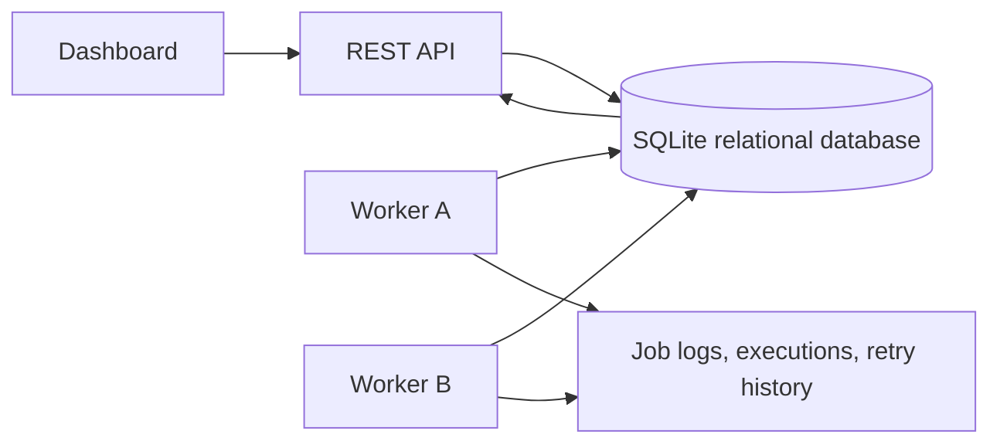
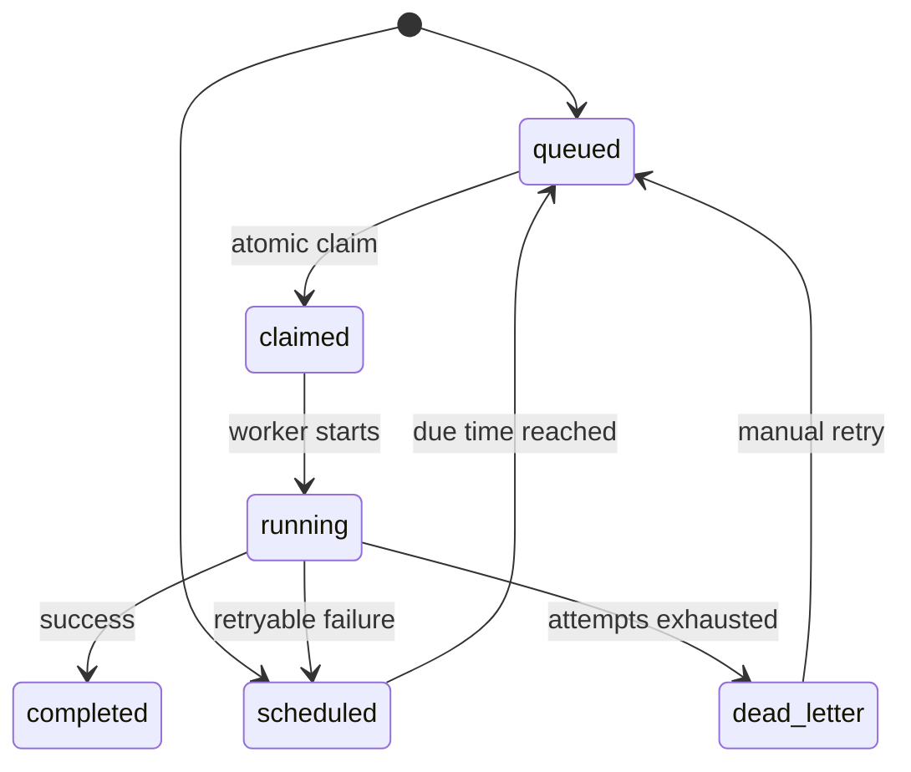

# Architecture

## Components

- REST API serves authentication, project management, queues, jobs, logs, health, and DLQ retry endpoints.
- SQLite stores the source of truth for users, organizations, projects, queues, jobs, executions, workers, heartbeats, logs, retry history, and DLQ entries.
- Workers poll for claimable jobs, atomically claim with `BEGIN IMMEDIATE`, execute concurrently, heartbeat, and drain on shutdown.
- Dashboard polls health and jobs every two seconds and provides queue controls, job creation, log inspection, and DLQ retry.

## Job Lifecycle

## Concurrency Model

Workers claim jobs inside a write transaction. The claim query filters paused queues and checks the queue concurrency limit by counting jobs in `claimed` or `running`. The selected row is immediately updated to `claimed`, assigned to the worker, and paired with a `job_executions` row before the transaction commits.

For PostgreSQL, the equivalent implementation would use `SELECT ... FOR UPDATE SKIP LOCKED` and advisory locks for cross-region or shard-level coordination.
