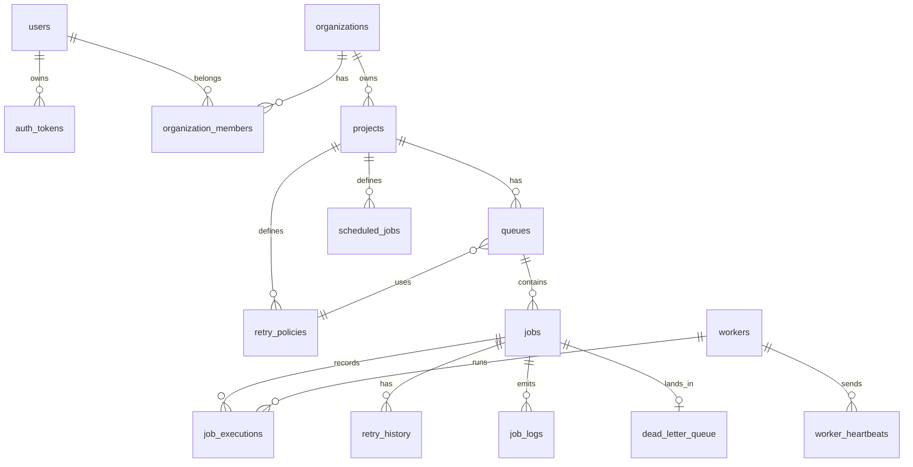

# ER Diagram and Schema Notes

## Keys and Constraints

- Every table uses an integer primary key for compact indexes and simple foreign keys.
- `organization_members` uses a composite primary key on `(organization_id, user_id)`.
- Project slugs are unique per organization.
- Queue names and retry policy names are unique per project.
- Jobs have optional project-scoped `idempotency_key` uniqueness to safely retry API submissions.
- `dead_letter_queue.job_id` is unique so a job can have only one active DLQ entry.

## Cascading Behavior

- Deleting an organization cascades through projects, queues, jobs, logs, executions, retry history, schedules, and DLQ rows.
- Deleting users cascades memberships and auth tokens.
- Deleted workers are retained indirectly by setting job execution worker references to null.
- Queue retry policy deletion sets `queues.retry_policy_id` to null, falling back to the system default policy.

## Indexes

- `idx_jobs_claimable(queue_id, status, scheduled_at, priority, created_at)` supports worker polling.
- `idx_jobs_project_status(project_id, status, created_at)` supports dashboard filtering.
- `idx_jobs_worker(locked_by_worker_id, status)` supports worker assignment inspection.
- `idx_executions_job(job_id, attempt_number)` supports execution history.
- `idx_logs_job_time(job_id, created_at)` supports ordered log reads.
- `idx_workers_status_heartbeat(status, last_heartbeat_at)` supports worker health checks.
- `idx_scheduled_jobs_next(is_active, next_run_at)` supports schedule materialization.

## Normalization and Performance

The schema separates queue config, retry policy, job state, execution attempts, logs, worker identity, and heartbeats. This avoids repeatedly embedding mutable policy or worker details in every job row. Job payloads and log context are JSON because they are application-specific blobs; high-cardinality operational fields remain relational for filtering and indexes.
